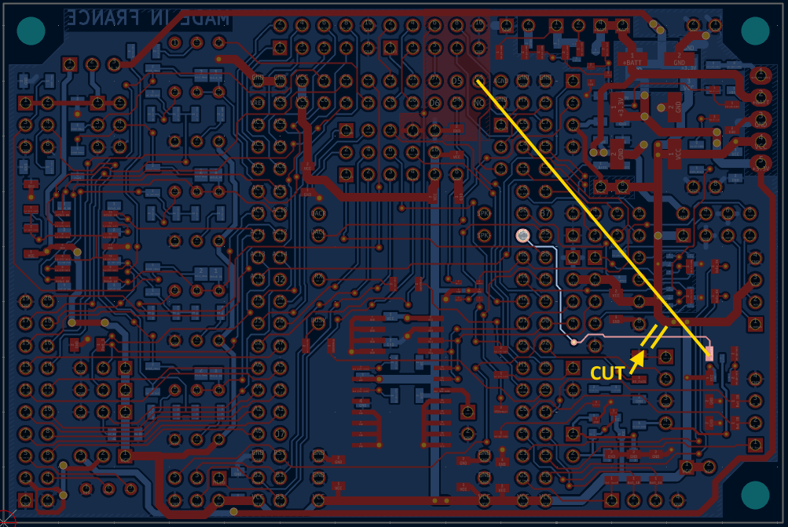
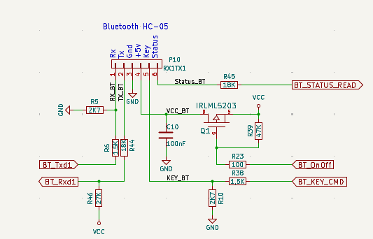
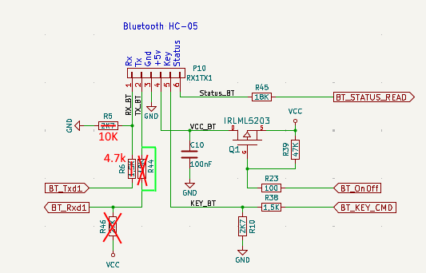
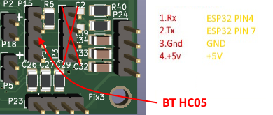
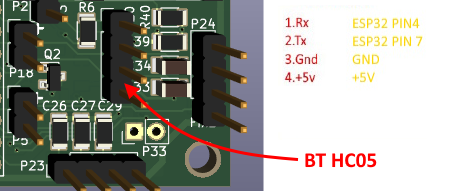
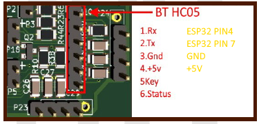
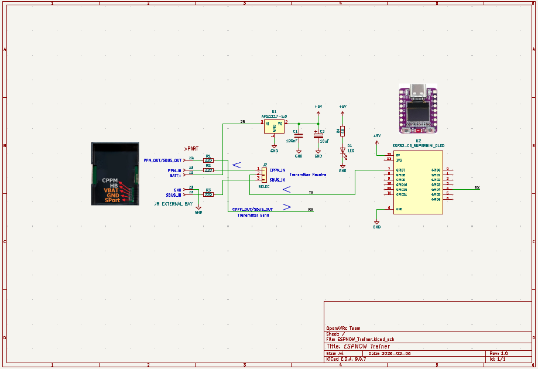
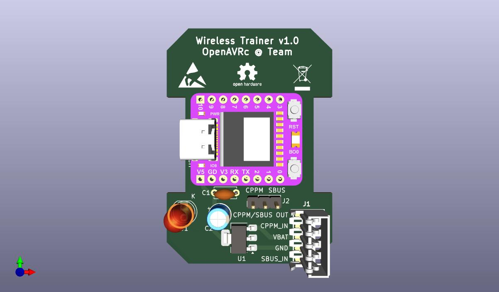
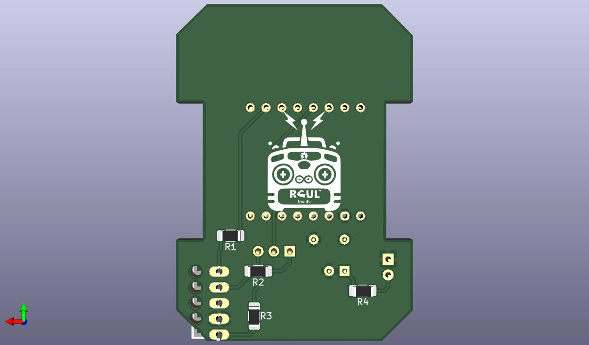

# Shield update
Several shield PCBs were produced, versions 2.0 to 2.2.  
The first two need to be slightly modified.  

## Shield v2.0
When the v2.0 board was created, Bluetooth functionality was not yet implemented.  
The pin assignment that activates it was not yet defined.  
Therefore, a connection must be created between pin G4 and resistor R40.  
  
The Q1 MOSFET (BSS84) also needs to be replaced with a much more efficient OA3401.  

## Shield v2.1
During the creation of PCB v2.1, the pin that controlled the HC05 was initially assigned to a pin that was subsequently reassigned to the Bluetooth KEY pin.  
This connection must be broken to connect resistor R40 to pin G4.  
  
Just like in version v2.0, you need to replace the Q1 mosfet with an oa3401.  

## Shield v2.2
R44 and R46 must not be installed. Replace R44 with a wire or a 0 ohm resistor.  
  
  

## Summary
| ** Shiled v2.0 ** | ** Shield v2.1 ** | ** Shield v2.2 ** |
| :---: | :---: | :---: |
|  |  |  |


# Wireless HC05 PCB simulator for External JR Bay
This board is usable with a RC transmitter as a Tx16s who has an external JR bay.  
It accept CPPM and SBUS ouput or CPPM and SBUS input .  

## Schematic
  

## PCB

  

## How to use
These commands are intended for diagnostics and configuration.
They do not interfere with OpenAVRc operation.

```
[USB] Commands:
  h              -> help
  m              -> force ROLE=MASTER (1)
  s              -> force ROLE=SLAVE  (0)
  ssid <name>    -> set/save STA ssid
  pass <pass>    -> set/save STA password
  creds          -> show saved STA creds (ssid + pass length)
  moutput  <x>   -> set/save MASTER output: 0=PPM 1=SBUS 2=HC05 3=PPM2PPM (reboot)
  sinput   <x>   -> set/save SLAVE   input: 0=PPM 1=SBUS 2=HC05 3=PPM2PPM (reboot)
  ppmpulse <x>   -> set CPPM pulse mode (0=PPM POS, 1=PPM NEG)
  scan [ms]      -> MASTER: ESPNOW scan (like AT+INQ) and list responders
  scan link      -> MASTER: ESPNOW scan and link to SLAVE
  i              -> info
  d              -> toggle BT debug (sniff UART BT, decode tf frames, show DATA-RX)
  dtf            -> toggle BT count tf stream from SLAVE
  sg             -> toggle Slave  TF generator (simulate student data)
  w              -> show FT state
  w ap           -> start FT in AP mode (OpenAVRc-FT / openavrc123)
  w sta          -> start FT in STA mode using saved creds
  w sta <s> <p>  -> start FT in STA mode + save creds
  w off          -> stop FT and return normal
  at?            -> at Commands help
  diag           -> version and more
  diag tf        -> diagnostic tf stream
  diag link      -> diagnostic link
```
