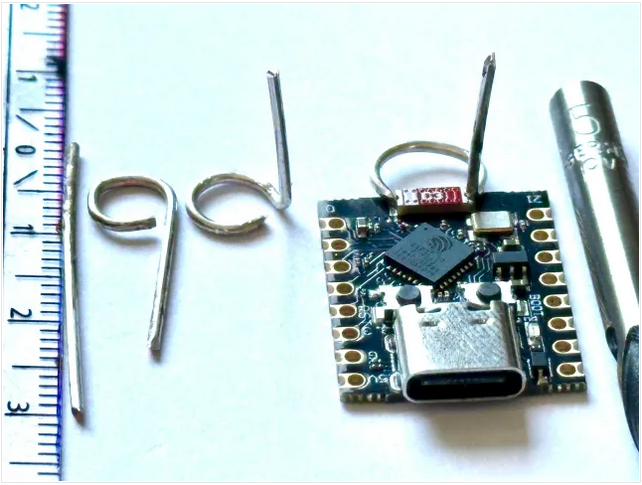

# Improved transmission and reception performance
Boosting ESP32-C3 SuperMini WiFi: A Simple and Effective Antenna Mod.   
Follow this [topic](https://peterneufeld.wordpress.com/2025/03/04/esp32-c3-supermini-antenna-modification/).  

The ESP32-C3 SuperMini modules are incredibly affordable (around €2) and come equipped with a compact SMD antenna.  
However, the small size of this antenna significantly limits the WiFi range.  
To easily overcome this problem, a simple antenna modification can be implemented, which drastically improves performance.  
  

## The Antenna Modification
This modification involves adding a 31 mm length of 1.0 mm silver-plated wire, configured as a quarter-wavelength (λ/4) antenna.
The bottom section of the wire is bent into a horizontal loop (approximately 16 mm of the wire length,  
forming a loop with a diameter of about 8 mm), while the remaining 15 mm section is angled vertically upwards.  

The circular loop is wound around the rod with a 5 mm drill bit, then the ends of the loop are widened so that they touch the terminals of the SMD antenna.  
The SMD antenna thus completes the wire loop mechanically, over a quarter of its circumference, but electrically, as a λ/4 element in parallel with a λ/8 wire.  
  
Solder the new antenna directly to both ends of the original SMD antenna on the ESP32 module.  
Specifically, solder to the 50 Ohm antenna pin (the left end of the original antenna) and to the other “hot”  
end of the original antenna. This effectively bypasses the original PCB antenna.  
Ensuring two good solder joints at both ends of the PCB antenna is crucial.  
Pay close attention to the position of the wire that goes up from the loop.  
The old aerial has been left in place as it becomes electrically ineffective in this configuration.  
