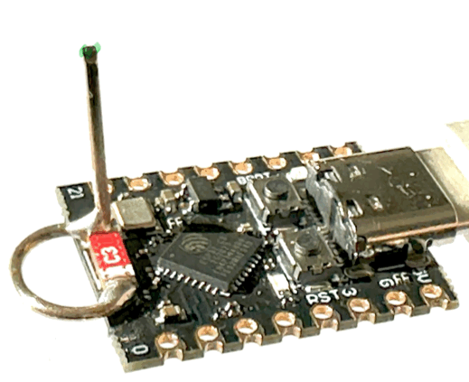

## Improved transmission and reception performance
Boosting ESP32-C3 SuperMini WiFi: A Simple and Effective Antenna Mod.   
Follow this [topic](https://peterneufeld.wordpress.com/2025/03/04/esp32-c3-supermini-antenna-modification/).  

The ESP32-C3 SuperMini modules are incredibly affordable (around €2) and come equipped with a compact SMD antenna.  
However, the small size of this antenna significantly limits the WiFi range. To easily overcome this problem,  
a simple antenna modification can be implemented, which drastically improves performance.  
  

