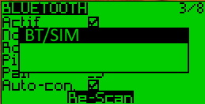
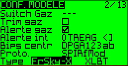
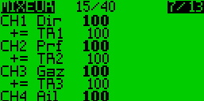
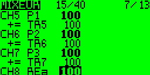
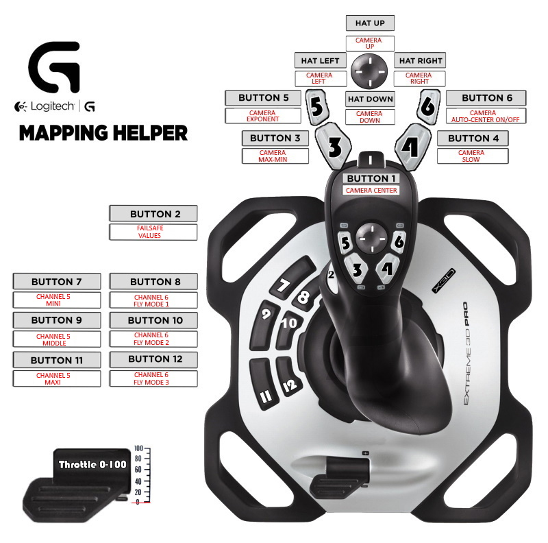

# Option Joystick

Cette option permet de commander la radio à partir d'un joystick USB de type Logitech 3D Pro ou autre.  
Ma première version était basée sur un [Pro Mini et un MAX3421e](https://github.com/Ingwie/OpenAVRc_Hw/tree/V3/Bluetooth/OpenAVRcBT_JoystickReader).  
Cette solution nécessite de remplacer l'ESP32 C3 côté slave par un ESP32 S3 capable de gérer une connexion [USB OTG](https://fr.wikipedia.org/wiki/USB_On-The-Go).  

Deux options sont possibles:
```
joyout <x> : tf=HC05_JOYSTICK  p2p=PPM2PPM_JOYSTICK
```
1. L'interface simule un signal compatible OpenAVRc [tf sXXX sXXX sXXX sXXX sXXX sXXX sXXX sXXX:CC](https://github.com/Ingwie/OpenAVRc_Hw/blob/V3/Bluetooth_Replacement/Architecture_Details.md#structure-et-g%C3%A9n%C3%A9ration-de-la-trame-tf).  
   Utiliser la commande **joyout tf**  
2. L'interface simule un signal binaire **p2p** compatible avec toute radio non OpenAVRc.  
   Utiliser la commande **joyout p2p**  

# Réaliser le câblage


## Screen Option
Vous pouvez utiliser un écran Oled compatible SSD1306.  

## Configurer la radio OpenAVRc.
1. Aller dans l'écran Bluetooth de la radio.
2. Configurer en mode 'Master'.
3. Lancer un **'Scan'**, vous devriez voir un **BT/SIM**.  Sélectionnez le.



4. Validez **'Auto Connect'**.
5. Créer un modèle et choisir autre chose que SIM/BT (par exemple **PPM** ou **Frsky-X**).



6. Configurer le mixer du modèle, par exemple, ainsi.

   

7. Eteindre puis redémarrer la radio, celle-ci devrait alors ce connecter au module réception, les leds des deux modules se mettront alors à clignoter toutes les 2 secondes.

Dans tous les cas, démarrer le module réception en premier.

## Utilisation du Joystick Logitech 3D Pro
- Le bouton **HAT** permet de gérer une caméra en direction (gauche/droite) et hauteur (hat/bas).  
- 3 **MODES** sont possibles:  
  * `exponentiel`, bouton 5(passage de haut en bas ou droite à gauche rapide)  
  * `lent`, bouton 4 (passage de haut en bas ou droite à gauche lent)  
  * `min max`, bouton 3  (passage de haut en bas ou droite à gauche d'un coup)  

* Le bouton 1 recentre la caméra.  
* Le bouton 6 met en route l'auto centrage de la caméra. 

* Les boutons 8,10 et 12 commandent la voie 5.
* Les boutons 7,9 et 11 commandent la voie 6. 

La caméra en connectée sur les voies 7 et 8.

  

