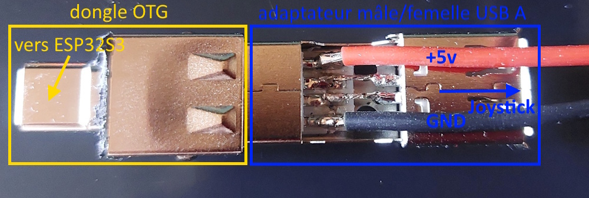

# Système USB OTG -- ESP32-S3 (Mode Host HID)

## Principe général

Dans ce projet, l'ESP32-S3 est utilisé en **mode USB Host (OTG)** afin
de lire un joystick USB HID (Human Interface Device).\
L'USB OTG (On-The-Go) permet à un microcontrôleur de fonctionner soit en
périphérique USB, soit en hôte USB.

Ici, l'ESP32-S3 agit comme un **PC miniature**, capable de piloter
directement un joystick USB.

------------------------------------------------------------------------

## Architecture matérielle

Le montage comprend :

-   ESP32-S3 (avec contrôleur USB intégré)
-   Interface OTG (adaptateur USB-A femelle)
-   Alimentation externe +5V / 2A
-   Câble USB A mâle/femelle câblé pin à pin

### Connexions USB

  Broche USB   Fonction
  ------------ ---------------------------
  VBUS         +5V alimentation joystick
  D+           Données USB
  D−           Données USB
  GND          Masse

L'ESP32-S3 pilote les lignes D+ et D−.  
L'alimentation externe fournit le +5V nécessaire au joystick via VBUS.  

  

------------------------------------------------------------------------

## Fonctionnement logiciel

1.  Initialisation du **USB Host**  
2.  Installation du driver **HID Host**  
3.  Détection du joystick USB 
4.  Ouverture de l'interface HID  
5.  Réception des rapports (reports)  

Chaque rapport peut contenir : - Axes (X, Y, Z, Throttle, etc.) - Boutons - Hat switch  

Les valeurs sont converties en impulsions **1000--2000 µs (format RC)**.  
Les canaux sont ensuite envoyés sous forme de **trame TF via module HC05**.  

------------------------------------------------------------------------

## Particularités importantes

-   Le joystick envoie des données uniquement lorsqu'un changement est
    détecté.
-   Le système mémorise en permanence les dernières valeurs reçues.
-   Une trame est générée à fréquence fixe (50 Hz) pour assurer un flux
    continu.
-   Une alimentation 5V stable est indispensable pour le fonctionnement
    du joystick.

------------------------------------------------------------------------

## Résumé global

Joystick USB  
→ USB OTG (ESP32-S3 en mode Host)  
→ Décodage HID  
→ Conversion en canaux RC (1000--2000 µs)  
→ Génération trame TF  
→ Transmission via Bluetooth (HC05)  
