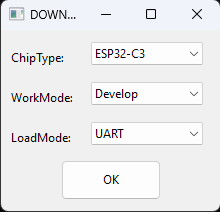
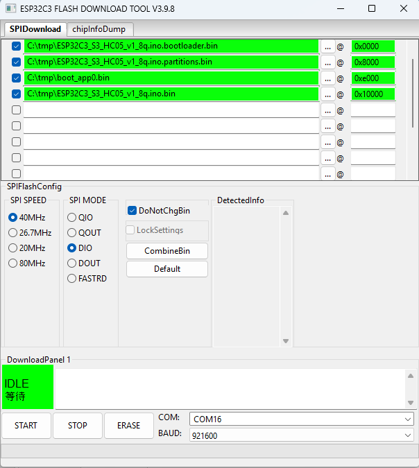

# Upload a firmware with Espressif Uploader Tool
This HC05 simulator firmware for an Mini ESP32C3/S3 Oled can be uploaded with  the [Espressif Uploader](https://dl.espressif.com/public/flash_download_tool.zip).  
You can found it also [here](ESP32-UPLOADER/flash_download_tool.zip).  

## How to compile and upload
1. Unzip and start flash_download_tool.exe.  
2. Hold the BOOT button and connect youe ESP32 to USB port.  
3. Select ESP32_C3 or ESP32_S3.  
  
4. Select firmware files 
Use the 3 dots to select each file in the following order.  
Select the good **COM port** and **921600 bauds**.  
  