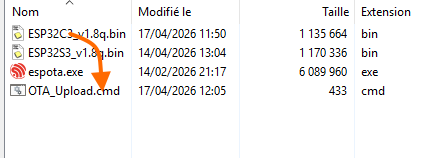

# Upload a firmware by OTA method
This HC05 simulator firmware for an Mini ESP32C3/S3 Oled can be uploaded by OTA mode.  
If your ESP32 has never been programmed with OTA firmware, you will need to load the firmware using the other two solutions, [](Software_Upload_FlashTool.md) or [](Software_Compilation.md).  

## How to upload
1. Download files from OTA_UPLOADER folder.  
2. Modifier le fichier OTA_Uploader.cmd.  

[OTA_UPLOADER files](OTA_UPLOADER).  
2. Open a console terminal, [Tera Term](https://github.com/TeraTermProject/teraterm/releases/download/v5.6.0/teraterm-5.6.0-x64.exe), or [Termite](https://www.compuphase.com/software/termite-3.4.exe) or [CoolTerm](https://coolterm.en.lo4d.com/download/mirror-ls1).  
   - Select the ESP32's COM port and 115200 bauds.  
   - Type **creds** command return you ESP32 IP address.  
   
	```
	[STA] ssid='kristie33140' passLen=9
	[NET] ESP32 IP : 192.168.0.31
	```
   - Open a cmd window and type **ipcong** command.  
   
    ```
    Adresse IPv4. . . . . . . . . . . . . .: 192.168.0.21  
    ```
   - Open OTA_Uploader.cmd and change IP address.   
   
    ```
    set ESP_IP=192.168.0.31  <-- ESP32 IP address
    set HOST_IP=192.168.0.21 <-- Your  PC address
	```
	
    Each ESP has its own address, so create a OTA_Uploader.cmd file for each ESP32.  
   - Type **ota 1**.  
   
3. Hold ESP32_C3 or ESP32_S3 file and drag and drop it on OTA_Upload.cmd file.  
.  