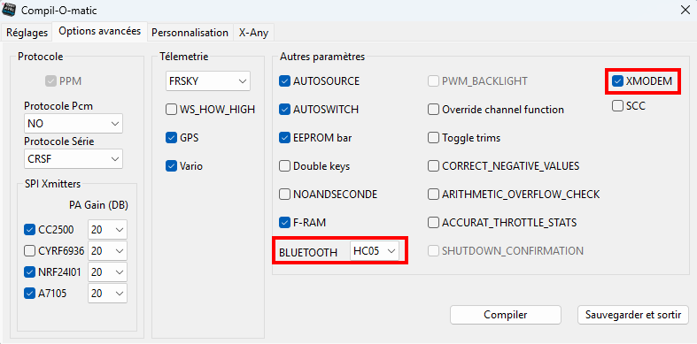
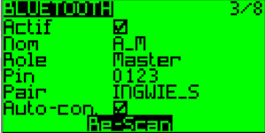
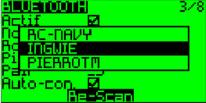
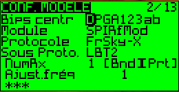
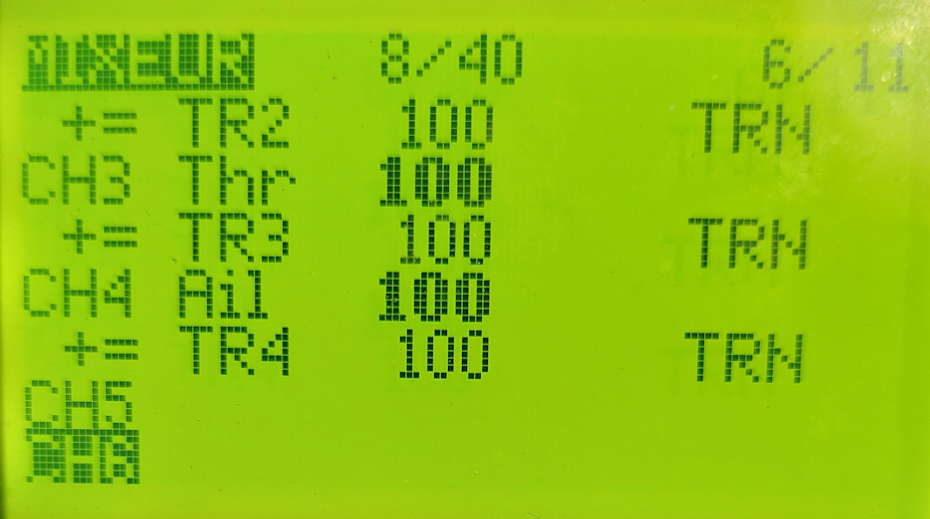
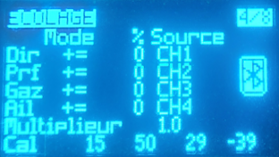
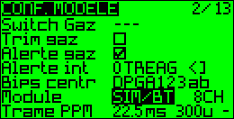

# How to configure two transmitters
Several modes are usable.
1. For two OpenAVRc transmitters with HC05/HC05.
2. For one OpanAVRc transmiiter and all other transmitter type with HC05/SBUS or PPM.
3. For all transmitters types with PPM/PPM or SBUS/PPM.

## Prerequisites
No modification of OpenAVRc firmware is required, but the OpenAVRc firmware must include the BT options.  
  

## OpenAVRc Master to OpenAVRc Slave transmitter
1. Connect one ESP32 on BT connector into each OpenAVRc transmitter, see [How to connect ESP32](Hardware/Hardware_Details.md)  
2. Power the radio  
3. Enter the Bluetooth menu  
4. Run a Bluetooth scan  
  
5. Select the student radio  
  
6. Pairing is complete  

## Create a model on OpenAVRc mster ans slave transmitters
In my tests, I set the **master** radio to receive the signal from the **student** radio.  

### Define a model into OpenAVRc as Master
  
  
If the master receive data from the slave, a BT logo appears on the right side of the screen.  
  

### Define a model into OpenAVRc as Slave
Select SIM/BT module type.  
  

### 

## OpenAVRc Master to OpenAVRc Slave transmitter

## OpenAVRc Master to an other Slave transmitter